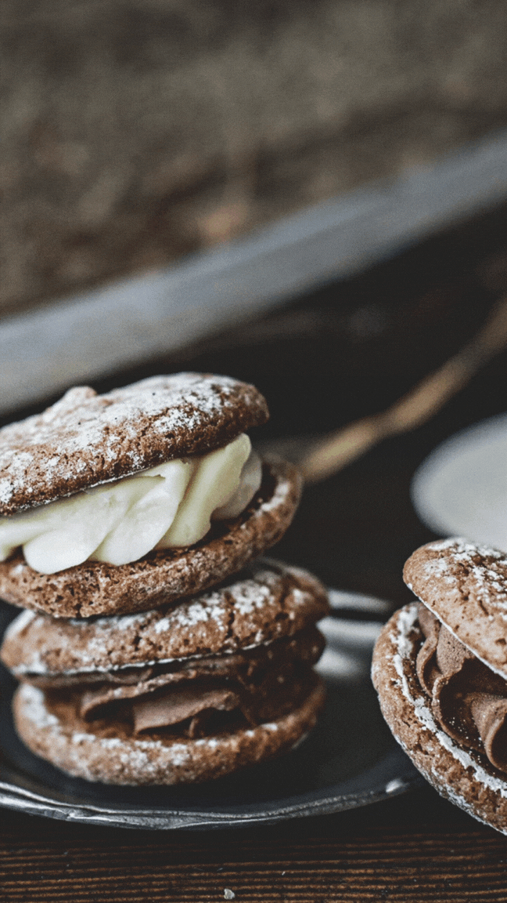

### PROYECTO JULIET DESSERTS

DESCRIPCIÓN

Se trata de una página web acerca de un emprendimiento familiar especializada en pasteleria y comidas dulces, como saladas caseras.

 

 TECNOLOGÍAS 

- HTML5  
- CSS3  
-JavaSScript  
- Bootstrap 5.3.2   
- Git/Github

 

ACERCA DE MI

Mi nombre es Lara Nishinakamasu, alumna del curso de Programación Web inicial - Front End Developer de BA Multiplica 2.0. Este es mi primer proyecto, el cual realice utilizando varias de las herramientas que fui aprendiendo a lo largo del curso. 

 
